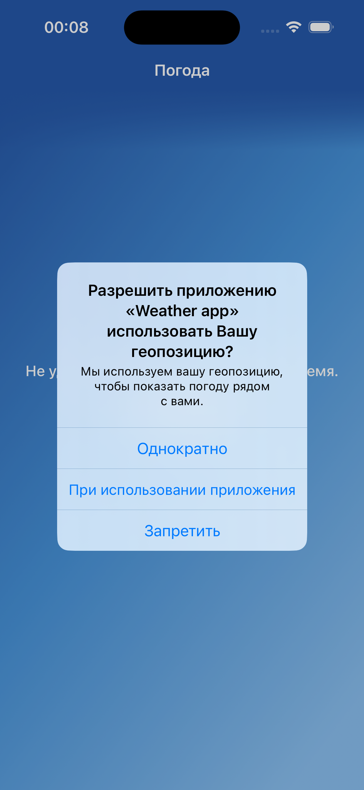
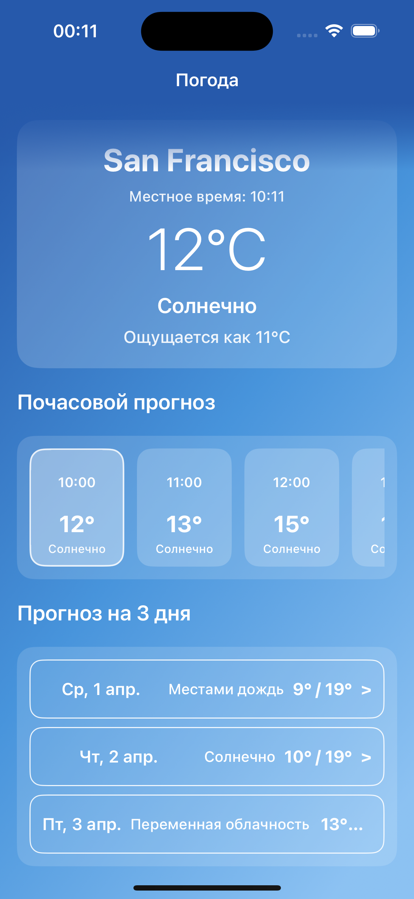
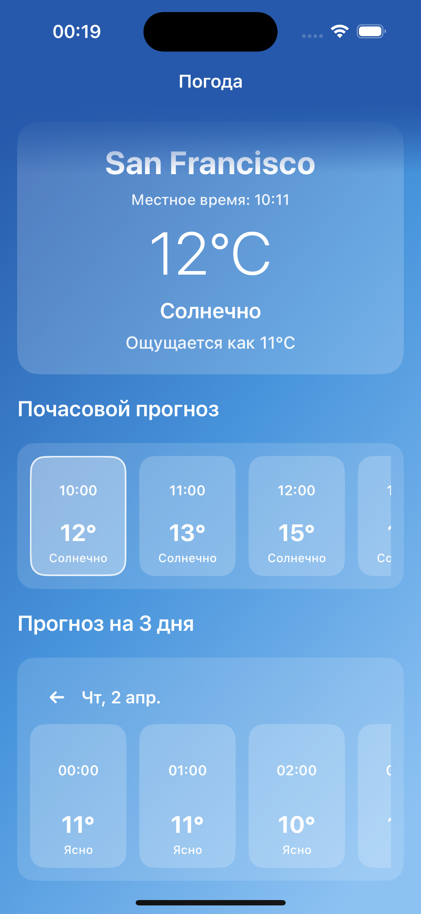
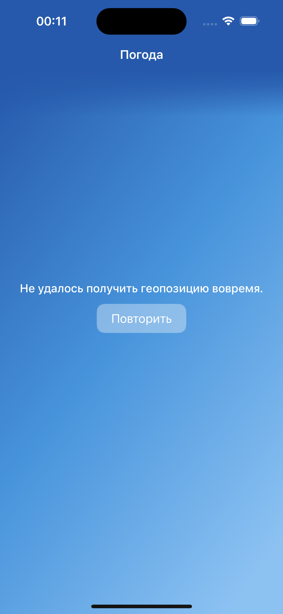

# Weather app

Мобильное приложение погоды на UIKit без Storyboard.  
Показывает текущую погоду, почасовой прогноз и прогноз на 3 дня.  
Использует геолокацию пользователя, а при ошибке показывает экран с кнопкой повторного запроса.

## Технологии
Компонент: Используется
UI: UIKit
Архитектура: MVVM + Combine
Геолокация: CoreLocation
Сеть: URLSession + async/await
Язык: Swift 5
Целевая платформа: iOS 18+

## Основной функционал
Погода на главном экране:
- текущая температура и состояние
- почасовой прогноз с текущего часа до конца дня
- прогноз на 3 дня

Почасовой просмотр по дню:
- нажатие на день открывает 24 часа выбранной даты
- плавный переход внутри блока прогноза

Состояния экрана:
- индикатор загрузки
- экран ошибки с кнопкой «Повторить»
- повторный запрос данных по кнопке

Геолокация:
- запрос разрешения при старте
- при недоступной геопозиции показывается ошибка

## Структура проекта
- `Weather app/MainModule/Model` — доменные модели погоды
- `Weather app/MainModule/View` — экран и UI
- `Weather app/MainModule/ViewModel` — состояние экрана и бизнес-логика отображения
- `Weather app/Service Layer/LocationService.swift` — получение координат
- `Weather app/Service Layer/NetworkServiceWithAsync.swift` — generic загрузка и декодирование
- `Weather app/Service Layer/WeatherService.swift` — формирование endpoint и API-запросы
- `Weather app/Service Layer/WeatherRepository.swift` — сборка доменной модели из API-ответов
- `Weather app/Coordinator.swift` — стартовый роутинг
- `Weather app/AssemblyModuleBuilder.swift` — сборка зависимостей модуля

## Скриншоты

## Как запустить
1. Открой `Weather app.xcodeproj` в Xcode.
2. Выбери симулятор или подключенное устройство.
3. Нажми Run.
4. Разреши доступ к геолокации.

## Тесты
В Xcode: `Cmd+U`
